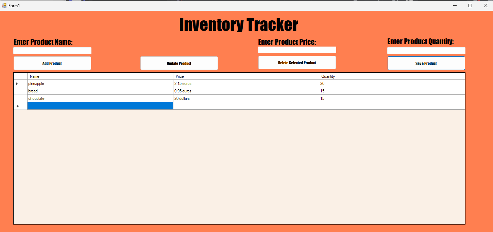

# Product-Tracker-Windows-Form-Version
### My first non-console application made with the help of internet, including OOP.
### To use this project, just download all the files from my repository and then go to the bin folder -> debug -> then select ProductTracker.exe
### How to use: Click Add Product button then fill in the empty fields: (Enter Product Name), (Enter Product Price), (Enter Product Quantity). Then press Save Product. A product will be added to the grid(table below). If you want to change it, select the corresponding row and press Update Product. If you want to delete it, select it again and then press Delete Selected Product.
### That is it, enjoy, here you can see how it looks like:

